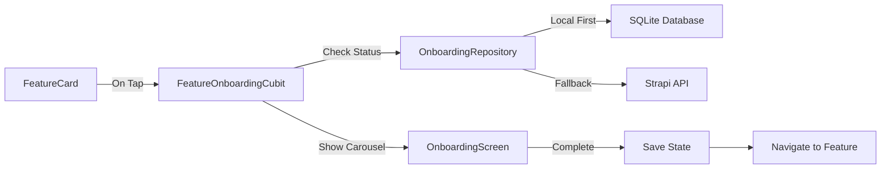

# Architecture Overview

## System Architecture

### High-Level Architecture

```mermaid
graph TD
    A[UI Layer] -->|Events| B[BLoC/Cubit]
```mermaid
```mermaid
  graph TD
    A[UI Layer] -->|Events| B[BLoC/Cubit]
    B -->|States| A
    B -->|Calls| C[Use Cases]
    C -->|Uses| D[Repositories]
    D -->|Local Data| E[SQLite Database]
    D -->|Remote Data| F[Strapi API]
    G[Dependency Injection] -->|Provides| B
    G -->|Provides| C
    G -->|Provides| D
```
1. **Menu Feature Cards**
   - Each feature card is rendered using `FeatureCardWithOnboarding`
   - Tapping a card triggers `FeatureOnboardingCubit.checkOnboardingStatus`

2. **Onboarding Status Check**
   - Cubit checks local SQLite database for cached onboarding data
   - If not available, falls back to checking completion status in SharedPreferences
   - If onboarding completed, navigates directly to feature

3. **Data Fetching**
   - If data not in SQLite, repository fetches from Strapi API
   - Data is then cached in SQLite for offline access
   - Uses `dartz` for functional error handling with `Either` and `TaskEither`

4. **Onboarding Carousel**
   - Displays using `OnboardingScreen` with `ResponsiveOnboardingCarousel`
   - Last slide includes "Don't show again" option
   - On completion, updates both SQLite cache and SharedPreferences

## Onboarding Flow Integration

### Component Diagram



### Detailed Flow

1. **Menu Feature Cards**
   - Each feature card is rendered using `FeatureCardWithOnboarding`
   - Tapping a card triggers `FeatureOnboardingCubit.checkOnboardingStatus`

2. **Onboarding Status Check**
   - Cubit checks local SQLite database for cached onboarding data
   - If not available, falls back to checking completion status in SharedPreferences
   - If onboarding completed, navigates directly to feature

3. **Data Fetching**
   - If data not in SQLite, repository fetches from Strapi API
   - Data is then cached in SQLite for offline access
   - Uses `dartz` for functional error handling with `Either` and `TaskEither`

4. **Onboarding Carousel**
   - Displays using `OnboardingScreen` with `ResponsiveOnboardingCarousel`
   - Last slide includes "Don't show again" option
   - On completion, updates both SQLite cache and SharedPreferences
## Data Layer

### SQLite Schema

```mermaid
  final String buttonLabel;
  final int cachedAt;
}
```
```dart
// onboarding_carousel table
class OnboardingCarouselModel {
  final String id;
  final String featureName;
  final String screen;
  final String title;
  final String imageUrl;
  final String header;
  final String body;
  final String buttonLabel;
  final int cachedAt;
}
```

### Data Flow

1. **Read Path**
   - UI requests data → BLoC/Cubit
   - Repository checks SQLite cache first
   - If cache miss or stale, fetches from network
   - Updates cache and returns data

2. **Write Path**
   - User interactions update local state
   - Changes written to SQLite
   - Optionally synced to backend when online

## Design Patterns

### State Management
- **BLoC Pattern**: For complex state management
- **Cubit**: For simpler state management needs
- **Freezed**: For immutable state classes and unions

### Dependency Injection
- **GetIt**: For service location
- **Injectable**: For code generation of DI setup

### Data Persistence
- **SQLite**: Primary data store via `sqflite`
- **SharedPreferences**: For simple key-value storage
- **Connectivity Plus**: For network state management

### Testing
- **Mockito/Mocktail**: For creating test doubles
- **BLoC Test**: For testing BLoCs and Cubits
- **Integration Tests**: For end-to-end testing
