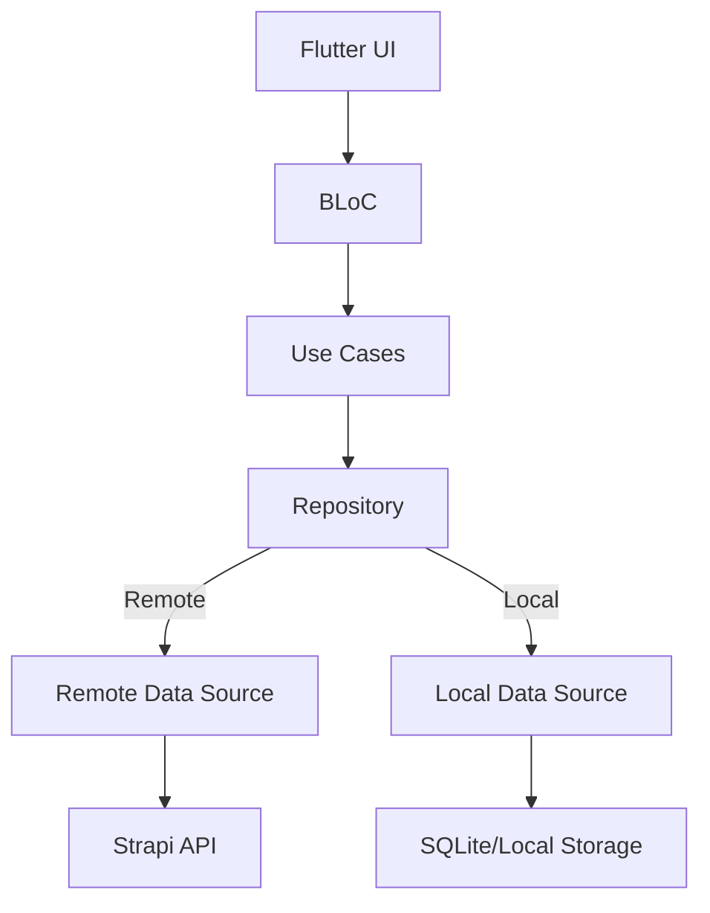

# Architecture

## Overview
Spacemate CMS is built with a Clean Architecture approach, separating core logic, data, and presentation layers for maintainability and scalability.

### Layers
- **Presentation**: UI widgets, BLoC for state management
- **Domain**: Entities, repositories, use cases (business logic)
- **Data**: Data sources (remote/local), models, repository implementations
- **Core**: Common utilities, error handling, dependency injection

## High-Level Design

## Key Packages
- flutter_bloc
- dio
- get_it
- sqflite
- shared_preferences
- material_color_utilities
- dynamic_color

## Data Flow
1. UI triggers BLoC event
2. BLoC calls use case
3. Use case interacts with repository
4. Repository fetches from remote/local data source
5. Data returned to UI via BLoC state

## Strapi Integration
- Menu data is managed in Strapi (`screens` collection)
- API endpoint: `/api/screens`
- Images stored in Cloudflare R2 (future)

## Testing
- Unit, widget, and integration tests are placed under `test/`

## Extensibility
- New features should follow the same layered structure
- Use dependency injection for all services
